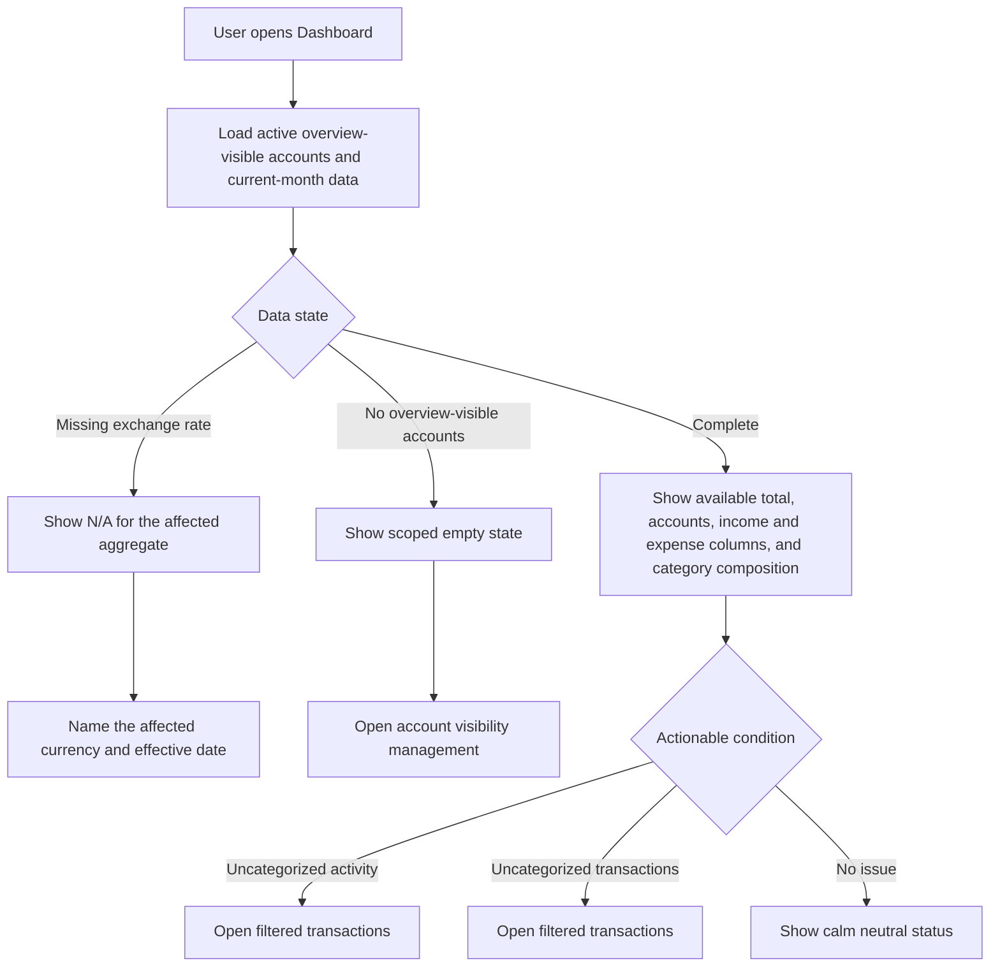
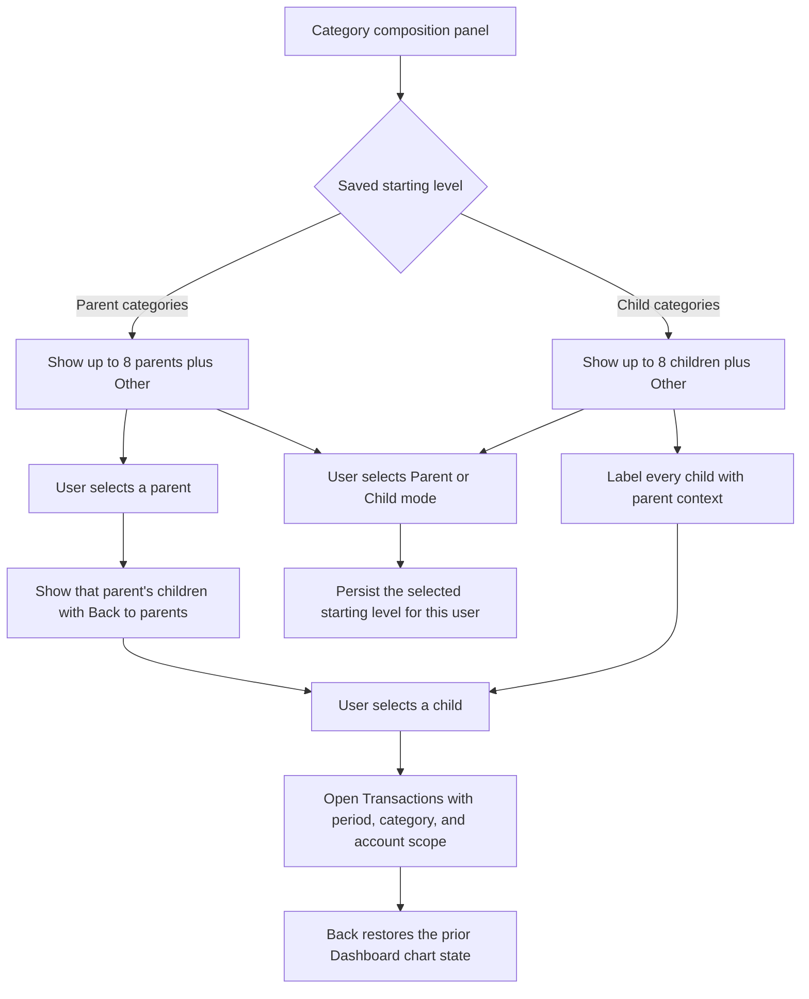
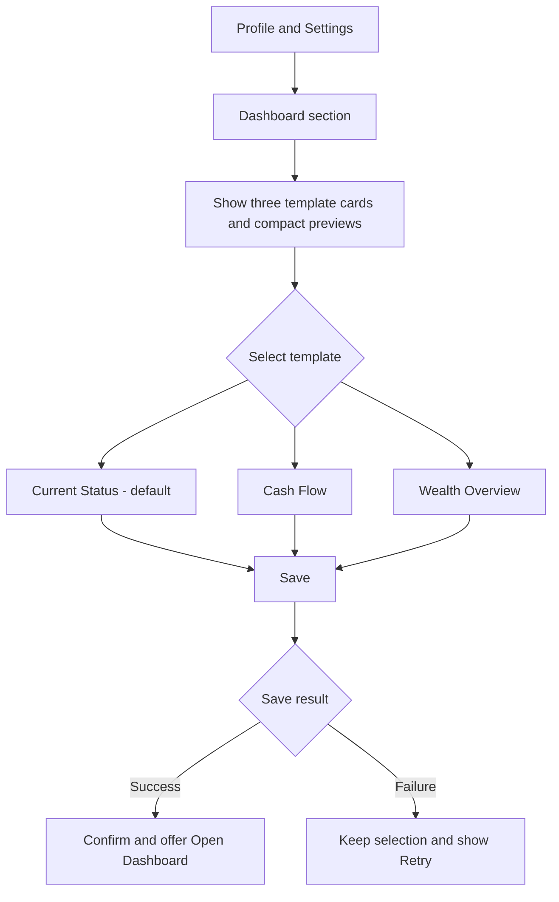
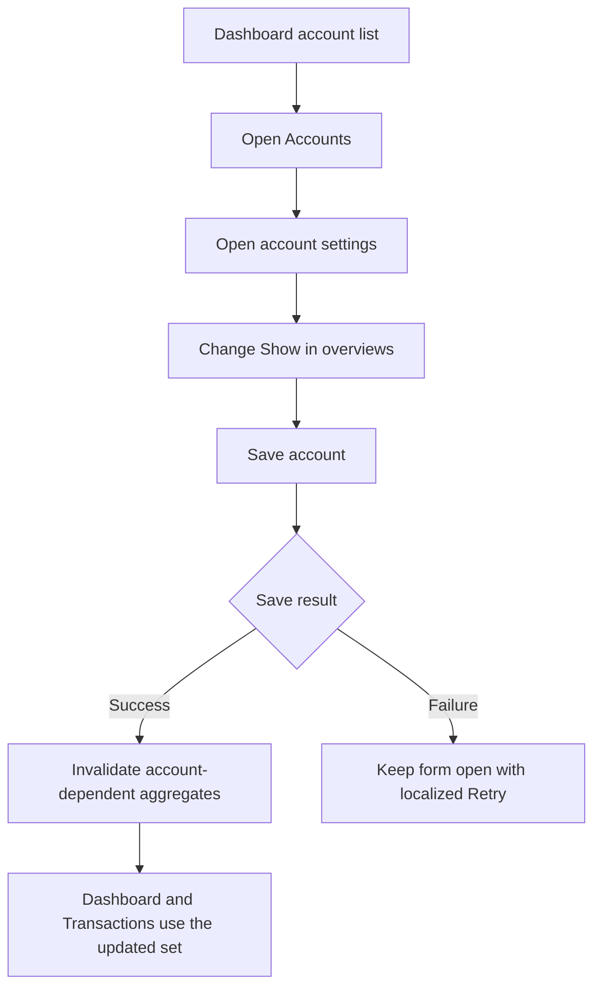

# UX Design Specification InEx

**Author:** Artiom
**Date:** 2026-07-28

---

<!-- UX design content will be appended sequentially through collaborative workflow steps -->

## Scope Boundary

This document defines shared cross-route experience, visual-system, page-frame, and responsive rules. The page-level design for Transactions, including its ledger, filters, KPIs, rate evidence, account-balance context, drawers, states, and accessibility criteria, is maintained in [Transactions UX Design Specification](transactions-ux-design-specification.md).

## Executive Summary

### Project Vision

InEx is a calm, precise personal-finance workspace for invited users managing accounts in several currencies, transactions, categories, monthly budgets, and reports. Operational pages prioritize fast comparison and trustworthy financial context over filling all available screen space.

### Target Users

- Account holders regularly reviewing balances, recent transactions, category spend, and budget status.
- English- and Russian-language users managing multiple currencies, long account/category names, and large values.
- Primarily desktop users, including wide-monitor users; mobile remains a release requirement.

### Key Design Challenges

- A fluid table can separate an item's identity from its important financial value by an excessive distance on wide displays.
- The solution must retain table-like scanning rather than turning dense financial workspaces into cards.
- One global width rule would harm pages with different tasks: reading, form entry, operational comparison, report analysis, and authentication.
- Every layout rule must work at 1440px, 1024px, 390px, and 360px, with Russian and long monetary values.

### Design Opportunities

- Establish named page-frame patterns—management, analytical, settings, and authentication—rather than one site-wide maximum width.
- Define task-priority column order for Accounts, Transactions, Categories, and Budgets so the primary label and value remain visually adjacent.
- Make the rules mechanically testable through tokens, page-class requirements, screenshot viewports, and explicit pass/fail criteria.

## Core User Experience

### Defining Experience

The core loop is reviewing financial records and immediately connecting each item to its relevant value: an account to its balance, a transaction to its amount, a category to its spend, and a budget to its remaining capacity. The layout makes this a short, predictable eye movement.

### Platform Strategy

InEx is a responsive web application optimized for mouse-and-keyboard use on desktop, including wide and ultrawide monitors. Mobile is a compact, stacked representation of the same information hierarchy—not a squeezed desktop table.

### Effortless Interactions

- Read an item and its primary amount without scanning across unused space.
- Compare adjacent values in the same column without losing row context.
- Find, filter, sort, expand, and edit records without altering the page frame.
- Move between management pages without relearning layout width or responsive behavior.

### Critical Success Moments

- A user can scan Accounts and identify the balance for any named account at a glance.
- A user can assess a transaction, category, or budget without hunting across distant columns.
- At wide widths, the interface feels intentionally composed rather than sparse.
- At narrow widths, controls and values reflow without page-level horizontal scrolling.

### Experience Principles

1. Keep the primary identity–value pair adjacent.
2. Cap reading and comparison width; do not cap analytical canvas width by default.
3. Give surplus desktop space to margins, not to the distance between related table columns.
4. Preserve data hierarchy across desktop and mobile; only the arrangement changes.
5. Make the width pattern a shared, tokenized rule with visual-test evidence.

## Desired Emotional Response

### Primary Emotional Goals

- Calm: financial detail is organized and never visually sprawling.
- Control: users can see what belongs together and act without searching.
- Trust: amounts, currencies, hierarchy, and budget state remain precise and consistent.
- Efficiency: routine review feels quick rather than demanding.

### Emotional Journey Mapping

| Moment | Intended feeling | Layout implication |
| --- | --- | --- |
| Opening a page | Orientation | Stable title, action placement, and page-frame type |
| Scanning records | Calm control | Compact identity-value relationships and aligned numeric columns |
| Comparing values | Confidence | Tabular numerals, consistent labels, no surplus space between related fields |
| Filtering or editing | Predictability | Frame stays stable; details open in a contained row or drawer |
| Viewing on mobile | Continuity | Same priorities stack into a readable single-column view |

### Micro-Emotions

- Confidence rather than uncertainty about which value belongs to which item.
- Focus rather than fatigue from repeatedly scanning across an ultrawide display.
- Clarity rather than clutter from trying to use all available space.
- Predictability rather than surprise when pages of the same type behave differently.

### Design Implications

1. Extra horizontal space becomes outer margin, never a wider gap inside a primary row.
2. Primary financial values receive the strongest typography and the nearest placement to their identity.
3. Secondary data may be grouped, reduced, or placed below its primary value.
4. The same page-frame category has the same desktop and mobile behavior.

### Emotional Design Principles

- Prefer composure over maximal use of screen real estate.
- Make financial relationships visible before adding decoration.
- Retain a stable visual rhythm across recurring management workspaces.

## UX Pattern Analysis & Inspiration

### Inspiring Products Analysis

InEx's existing design language is the visual baseline: quiet, dense, precise, table-first operational screens. The specification does not copy another product's visual identity.

### Transferable UX Patterns

- Data grids use a clear scan path: text left-aligned, monetary values right-aligned, and headings aligned with their cells.
- Related fields may be combined when doing so reduces distance without reducing comparison; for example, a base-currency equivalent can sit below a primary balance.
- Desktop management workspaces constrain the working area; spare width becomes surrounding whitespace.
- Tables retain row context through subtle borders, hover state, and group headers rather than heavy decoration.
- Mobile stacks the same priority order rather than horizontally scrolling a desktop grid.

### Anti-Patterns to Avoid

- A universal width cap applied to charts, dashboards, reports, forms, and authentication screens.
- A flexible `1fr` identity column that absorbs all ultrawide surplus.
- Two-column card grids for operational records, which break comparison and currency grouping.
- Hiding essential financial values behind a hover, drawer, or expansion.
- Adding zebra striping solely to compensate for a page that is too wide.

### Design Inspiration Strategy

Adopt compact, conventional table behavior and information hierarchy; adapt it to InEx's grouped multi-currency accounts and responsive requirements; avoid decorative or card-first reinterpretations of financial records.

## Design System Foundation

### 1.1 Design System Choice

Use the existing InEx token and primitive layer on top of Ant Design. Do not introduce a new component library or a wholesale custom system for the page-frame work.

### Rationale for Selection

- The application already uses Ant Design for accessible controls, forms, date pickers, and drawers.
- InEx already has shared visual tokens and page primitives; the new page-frame patterns belong in that layer.
- Replacing the component library would expand scope without improving the scan-distance problem.
- A tokenized solution makes the rules consistent and mechanically verifiable.

### Implementation Approach

Create shared layout tokens and page-frame classes:

- `--frame-management-max: 1360px`
- `--frame-settings-max: 1120px`
- `--frame-reading-max: 760px`
- `--frame-auth-max: 540px`
- `--frame-analytics-max: 1440px`

Pages declare their frame type; page-specific CSS declares only internal grids and responsive reflow. The shell supplies outer gutters and centers a constrained frame.

### Customization Strategy

- Keep existing InEx color, spacing, radius, typography, and money-format tokens.
- Add frame and column-priority tokens before changing individual pages.
- Use shared visual-QA checks to enforce each declared frame.
- Do not add another dependency or redesign existing accessible controls for this work.

## 2. Core User Experience

### 2.1 Defining Experience

The defining interaction is scanning a financial record and its outcome. Accounts, Transactions, Categories, and Budgets are working ledgers: each visible row answers what the item is, what its financial outcome is, and whether supporting context is relevant.

### 2.2 User Mental Model

Users expect the row label and outcome to be visible together. They should not need to trace a row across an ultrawide canvas.

### 2.3 Success Criteria

- The primary identity and financial value are simultaneously visible without an eye sweep across empty space.
- Users can compare values vertically while keeping row identity clear.
- Amounts remain right-aligned, tabular, and consistently ordered.
- Search, filtering, grouping, expansion, and editing preserve the frame and scan path.
- No instruction or onboarding is required; this is an established ledger pattern.

### 2.4 Novel UX Patterns

The work uses an established ledger pattern. The InEx-specific adaptation is a shared frame taxonomy and currency-aware grouping without separating primary identity from primary financial value.

### 2.5 Experience Mechanics

1. Initiate: open a management page, select a view or scope, or search.
2. Scan: read primary identity and key value as a compact pair; compare key values down the column.
3. Inspect: use secondary metadata, grouping, or expanded details only when needed.
4. Act: select a row or use the page action; the drawer or inline edit does not disturb the list frame.
5. Complete: return to the same list, filter state, width, and position.

## Visual Design Foundation

### Color System

Keep the existing InEx semantic tokens and calm finance palette. The width-pattern work introduces no new colors, gradients, or decorative treatment. Income, expense, transfer, and warning colors retain their financial meaning; borders and muted surfaces distinguish rows and groups without zebra striping; color never becomes the only signal for financial state.

### Typography System

- Inter remains the interface font.
- JetBrains Mono with tabular numerals remains the numeric font.
- Primary financial values use the strongest numeric weight in a row.
- Supporting values use smaller, muted text beneath or beside the primary value.
- Text labels remain left-aligned; comparable monetary values remain right-aligned.

### Spacing & Layout Foundation

- Retain the existing 4px spacing scale and desktop/mobile gutters.
- A page frame is centered within the shell; it is not a card within another card.
- Management pages use a maximum working width of 1360px from desktop width upward.
- Surplus width is allocated evenly to outer margins.
- Row grids use bounded primary columns or page-specific templates, never a flexible first column that absorbs all remaining width.
- Internal toolbar, hero, and list widths align to the same frame edge.

### Accessibility Considerations

- At 200% browser zoom, content reflows without page-level horizontal scrolling.
- At 1024px and below, a page may reduce or combine secondary columns before mobile stacking begins.
- At 768px and below, rows use the established stacked mobile pattern.
- Values, controls, Russian labels, and long amounts must not clip, overlap, or force page-level horizontal scrolling.

## Page Frame And Scanning Contract

### Shared Rules

1. The shell retains its current outer gutters: 40px on desktop and 16px on mobile.
2. Each route renders its page header and body inside the same named page frame. The header action must align to the frame, not to the browser edge.
3. A frame is `width: 100%`, centered, and capped only at its named maximum. It does not add a nested surface or alter the page's existing cards.
4. At a 1440px viewport, the 40px shell gutters leave 1360px of content. Management pages therefore preserve their current approved 1440px composition. The cap only takes effect above 1440px.
5. From 769px through 1439px, the available content width remains fluid within the shell gutters. At 768px and below, mobile rules take precedence and all frames are full width within 16px gutters.
6. Extra desktop space belongs to the outer margins. It must never be allocated as an unbounded gap between a record's identity and its primary financial value.
7. A management row must show its primary identity before its primary financial value, with no secondary column between them. Supporting values may appear below either primary value or after the pair.
8. Text is left-aligned; comparable monetary values are right-aligned; every amount uses tabular numerals. Header alignment matches its cell alignment.

### Frame Tokens

| Token | Maximum | Intended use |
| --- | ---: | --- |
| `--frame-management-max` | 1360px | Accounts, Transactions, Categories, Budgets, tabular report details |
| `--frame-analytics-max` | 1440px | Dashboard, Reports hub, standard report drill-downs |
| `--frame-analytics-wide-max` | 1600px | An individual chart canvas only when its readable content requires it |
| `--frame-settings-max` | 1120px | Profile and settings |
| `--frame-reading-max` | 760px | Narrative copy, empty-state explanation, report introductions |
| `--frame-auth-shell-max` | 1200px | Desktop authentication split layout |
| `--frame-auth-form-max` | 440px | Authentication form column |

### Route Rules

| Route | Frame | Desktop rule | Tablet/mobile rule | Primary scan target |
| --- | --- | --- | --- | --- |
| Dashboard | Analytics, 1440px | Summary cards and panels may use the full analytics frame; no full-viewport card stretching. Intro copy remains 760px. | Grid reduces before cards become unreadably wide; one-column mobile layout. | KPI label to value; chart to its legend/summary. |
| Transactions | Management, 1360px | See [Transactions UX Design Specification](transactions-ux-design-specification.md). | See [Transactions UX Design Specification](transactions-ux-design-specification.md). | See [Transactions UX Design Specification](transactions-ux-design-specification.md). |
| Accounts | Management, 1360px | Hero, toolbar, list, and currency groups align to one frame. Each row orders Account, Balance, base equivalent, then supporting currency/share and action. Group subtotal follows the same balance alignment. | At 1024px, currency and share become secondary metadata; at 768px, stack balance above name metadata using the existing mobile pattern. | Account name to balance. |
| Categories | Management, 1360px | Keep Category and Spend adjacent. Activity, budget indicator, and action follow them; hierarchy remains in the category zone. | At 1024px, combine activity/budget support; at 768px, preserve hierarchy and place spend in the compact value area. | Category name to spend. |
| Budgets | Management, 1360px | Keep Category and Usage adjacent. Usage combines progress plus spent-of-budget. Remaining and pace are supporting values, not widely separated columns. | At 1048px, reduce to the existing one-column compact row; at 768px retain mobile toolbar and month-switcher behavior. | Category to usage and remaining. |
| Reports hub | Analytics, 1440px | Cards use a bounded grid inside the analytics frame; a report-launch card must not become excessively wide. Intro copy remains 760px. | Two columns where viable, then one-column mobile. | Report title to its preview metric. |
| Report drill-down | Analytics, 1440px | Header, filters, chart, and accessible summary align to the frame. Only an explicitly marked chart canvas may use the 1600px wide variant. Any tabular detail uses the 1360px management frame. | Chart reflows; text/table summary remains available; no horizontal page overflow. | Measure/legend/filter to chart or table result. |
| Profile and settings | Settings, 1120px | Keep the settings navigation and form panel compact. Form controls have useful maximum widths; help panels do not stretch to the screen edge. | Settings navigation becomes horizontal internal scroll; inner grids collapse before 768px. | Setting label to control and validation state. |
| Login and registration | Auth shell, 1200px; auth form, 440px | The visual split layout is centered and bounded; the form column remains readable. | Brand panel hides; form becomes full width within mobile gutters. | Field label to input and error. |
| Not found and standalone empty states | Reading, 760px | Centered reading frame. | Full width within mobile gutters. | Problem statement to recovery action. |

### Management-Row Rules

1. Each page declares its primary identity/value pair; page-level specifications define the pair and its ordering.
2. The primary value column is the first numeric column after the primary identity zone.
3. Currency, percentage, base equivalent, status, pace, tags, hierarchy metadata, and row action are secondary. They cannot be placed between the primary pair.
4. Use an explicit page-specific column template with bounded columns. Do not use an unconstrained `1fr` identity column that absorbs ultra-wide space.
5. Related values may be combined as a primary line plus muted subline when this improves adjacency; do not combine independently comparable values merely to reduce columns.
6. Group headers, list headers, normal rows, expanded rows, loading rows, and empty states must inherit the same frame width.

### Responsive Rules

| Viewport | Required behavior |
| --- | --- |
| 1920px and wider | Frame caps apply; management content measures 1360px, analytics 1440px, settings 1120px, and auth shell 1200px. |
| 1440px | Management pages retain the existing 1360px content width after shell gutters; this is the desktop visual-parity baseline. |
| 1024px | Frames are fluid within shell gutters. Secondary management information may be combined or hidden behind existing disclosure before any horizontal page scroll is introduced. |
| 768px and below | Page frame is full width within 16px gutters. Mobile row stacking and toolbar wrapping take precedence. |
| 390px and 360px | No page-level horizontal overflow, clipped controls, overlap, or bottom-nav occlusion. Long EN/RU labels and long amounts remain readable. |

### Implementation Rules

1. Implement frames as shared tokens plus a shared `PageFrame` or equivalent shell utility; do not add a separate maximum-width rule in each page stylesheet.
2. Give every top-level route an explicit frame classification. A route without one fails review.
3. Move the page-header inner content into the same frame as the page body. Keep outer shell/background behavior unchanged.
4. Keep current API calls, route protection, i18n, currency calculations, filters, sorting, and mobile navigation unchanged; this is a layout contract.
5. Preserve existing cards, groups, drawers, and row interactions. Frame work must not turn ledger pages into card grids.

### Verification Rules

| Check | Pass condition |
| --- | --- |
| Frame width | At 1920px, measured content width is at most the route token maximum; at 1440px, a management frame is 1360px within a 1px rounding tolerance. |
| Frame alignment | Page header inner content, hero/card, toolbar, list, and footer/pagination share the same left and right frame edges. |
| Column priority | The DOM/grid order places the primary identity before the primary value, with no secondary cell between them. |
| No artificial expansion | At ultrawide width, a management-row identity column does not grow merely because the viewport grows beyond 1440px. |
| Numeric scan | Monetary columns are right-aligned with tabular numerals; headers use matching alignment. |
| Responsive reflow | Screenshots at 1440px, 1920px, 1024px, 390px, and 360px contain no overlap, clipping, page-level horizontal overflow, or bottom-nav occlusion. |
| Content stress | Run populated, empty, filter-empty, drawer-open, expanded-row where available, long EN/RU label, and long-amount states for each affected route. |
| Regression scope | Build, lint, and relevant visual-QA harnesses pass. Update the visual-QA checklist with screenshot evidence and a `dataMode` value. |

## Design Direction Decision

### Design Directions Explored

Six Dashboard directions were explored in `ux-design-directions.html`: Current Status, Accounts First, Spending Pace, Configurable Modules, Financial Console, and Calm Minimum. The alternatives varied information hierarchy, density, account prominence, spending analysis, customization, and mobile behavior while retaining the existing InEx visual foundation.

### Chosen Direction

Use **Current Status** as the default Dashboard template. Its primary purpose is to answer, in order:

1. How much money is available now across the user's visible accounts?
2. Which accounts hold that money?
3. How do current-month income and expenses compare?
4. Which parent and child categories compose current spending?
5. Which parent and child categories compose current income?
6. Which transaction or data-quality conditions require attention?

The default template includes:

- A dominant visible-accounts total in the user's base currency, with included-account count, effective date, and conversion-completeness state.
- A compact list of visible accounts showing native balance and base-currency equivalent where available.
- A current-month income-versus-expense column visualization. Exact totals remain available in chart labels, tooltips, and the accessible summary but are not presented as competing headline-number cards.
- Separate income and expense category-composition donuts, each with a persistent Parent categories / Child categories starting-view switch. Parent mode drills into the selected parent's children; child mode begins with child categories across parents.
- A short actionable-attention list rather than another historical chart.

Historical net worth is not part of the default Current Status template. It remains available through Reports and an optional wealth-oriented Dashboard template.

### Design Rationale

The second user's primary need is an operational current-state overview rather than a historical or report-oriented overview. The present Dashboard gives equal visual weight to several monthly KPIs and dedicates a large panel to historical net worth, but it does not expose the accounts behind the current position or make the scope of its totals clear.

Current Status makes the Dashboard a concise answer surface rather than a second Reports page. Aggregates and supporting lists use the same visible-account scope. Selecting an account, category, warning, or chart element leads to the relevant filtered workspace without moving edit and management workflows onto the Dashboard itself.

The category hierarchy supports both overview and direct-detail entry. The chart may show up to eight explicit category sectors plus Other. In Parent categories mode, selecting a parent reveals only that parent's children. In Child categories mode, the initial chart shows the highest-spend child categories across parents and includes parent context in every label. The user's last selected mode is restored on later visits. Both modes preserve the current period and account scope when the user drills into transactions.

### Implementation Approach

**Current delivery scope (2026-09-30):** implement one shared Current Status Dashboard first. Dashboard templates, Profile-based Dashboard settings, server-persisted category-level preferences, and the separate Dashboard Attention List remain future options and are not part of Story 10.4a. The page-level Add transaction action and Parent/Child control remain in scope, but category-level selection is not persisted in this increment. Missing-rate and panel-failure attention stays local to the affected panel until a dedicated attention list is implemented.

Provide three curated, per-user Dashboard templates:

1. **Current Status** — the default; visible accounts, available total, current-month income-versus-expense columns, separate expense and income composition, and actionable warnings.
2. **Cash Flow** — current and comparable-period income and expenses, net flow, and category contribution without budget widgets.
3. **Wealth Overview** — net worth, currency distribution, and historical trends.

Budget widgets are excluded from Dashboard templates. Budget planning, remaining amounts, burn rate, and actual-versus-plan analysis remain in the dedicated Budgets workspace.

Template selection belongs in Profile and Settings, not on the Dashboard. The Dashboard may expose a low-emphasis link to its settings only when discoverability testing shows it is necessary; it must not reserve permanent header or card space for template selection.

Dashboard template choice and account visibility are stored separately for each authenticated user. One user's configuration cannot affect another user's Dashboard. Version one uses curated templates rather than free-form widget placement. Later customization may add per-template block visibility and ordering, with desktop and mobile ordering handled deliberately rather than assumed to be identical.

Every converted aggregate must disclose its base currency and effective date. If any required exchange rate is unavailable, the Dashboard shows `N/A` and named-currency evidence instead of a partial total. Charts provide accessible textual or tabular summaries, keyboard-operable drill-downs, and localized English and Russian labels.

## User Journey Flows

### Review the Current Financial Position

The default Dashboard delivers value without interaction. It loads the current user's active overview-visible accounts and current-month aggregates, then presents the available total, account composition, income-versus-expense columns, separate income and expense category composition, and actionable warnings.



Incomplete currency conversion produces `N/A` with named-currency and effective-date evidence rather than a partial aggregate. Individual panel failures do not replace otherwise usable Dashboard content.

### Explore Spending from Category Composition to Transactions

The chart provides a persistent starting-level switch. Parent categories mode supports hierarchical drill-down; Child categories mode exposes detailed spending immediately. The chart may render up to eight explicit sectors plus Other.



Other opens a ranked accessible list rather than becoming a dead-end sector. Every legend entry includes amount and percentage. Selecting a category preserves the current period and relevant account scope in URL-backed transaction filters.

### Select a Dashboard Template

Dashboard template selection lives under Profile and Settings, not on the Dashboard surface.



The template choice belongs to the authenticated user, takes effect on the next Dashboard render, does not alter Reports access, and never changes another user's configuration.

### Control Accounts Included in Operational Overviews

The existing favourite-account preference becomes the consistent operational visibility rule for Dashboard and Transactions. Its user-facing label should describe behavior, such as Show in overviews, rather than the abstract Favourite label.



`IsEnabled` continues to represent whether an account is active. `IsFavourite` represents whether an active account participates in operational overview surfaces. Dashboard account lists and totals use only active accounts with `IsFavourite = true`; native balances remain visible, while cross-account totals follow the complete-or-`N/A` conversion rule.

### Journey Patterns

- Dashboard surfaces state; domain pages own editing and management.
- Aggregates drill down to their source accounts, categories, or transactions.
- Period, account scope, category level, and filter context survive cross-route navigation.
- Panel-local loading and errors preserve unaffected information.
- Explicit settings changes provide confirmation and predictable recovery.
- Template, category-level, and account-visibility preferences remain scoped to the authenticated user.

### Flow Optimization Principles

- Deliver the primary answer without requiring a click.
- Use progressive disclosure for account lists and parent-category hierarchy without forcing it on users who prefer child-category detail first.
- Permit up to eight explicit donut sectors plus Other; use the adjacent legend and accessible summary for exact comparison.
- Make Other actionable through a ranked detail list.
- Use columns for income-versus-expense comparison and donuts for composition; each visualization answers a distinct question.
- Never present partial multi-currency totals as complete.
- Preserve mobile priority order: available total, accounts, spending position, category composition, and warnings.

## Component Strategy

### Design System Components

The Dashboard continues to use the existing InEx token and primitive layer over Ant Design. `BasicPage` supplies the analytics frame. `Num`, `SegmentedControl`, `InExButton`, `IconBtn`, `EmptyState`, `ErrorBanner`, Ant Design `Alert`, `Spin`, and `Skeleton` cover formatting, controls, feedback, and loading states. Recharts supplies bar and donut rendering without a new dependency.

`ReportAccessibleSummary` should be promoted to a shared `ChartAccessibleSummary` because Dashboard and Reports require the same accessible chart companion. The existing account-balance companion provides the source pattern for reusable balance rows.

### Custom Components

#### AvailableBalanceHero

Displays the complete available balance across active overview-visible accounts, the account count, base currency, effective date, and conversion status. It supports loading, complete, zero, no-account, unavailable-conversion, and error states. It never displays a partial multi-currency aggregate.

#### OverviewAccountList

Displays reusable account-balance rows with native balance and optional base equivalent. It shares row behavior with the Transactions account-balance companion. Mobile initially shows three accounts with accessible expansion. Account rows remain independently usable when the aggregate conversion is unavailable.

#### CashFlowColumnChart

Compares current-month income and expenses as two clearly labelled columns. Column height is the primary visual encoding; exact values remain available in labels, tooltips, and `ChartAccessibleSummary`. Income and expense direction use labels and icons in addition to semantic color. Zero, equal-value, extreme-ratio, no-activity, incomplete-conversion, loading, and error states are explicit. Selecting a column opens Transactions with the corresponding type and current-month filters.

#### CategoryCompositionDonut

Renders either income or expense composition using the same typed component with an explicit `flowType` variant. It supports a persistent Parent categories / Child categories starting mode, up to eight explicit sectors plus Other, parent-to-child drill-down, parent context in child labels, keyboard activation, and URL-backed navigation to Transactions.

The donut legend includes category name, percentage, and amount. `Other` opens a ranked accessible detail list. The adjacent `ChartAccessibleSummary` is the source for screen-reader and export-oriented review.

#### DashboardAttentionList

Shows only actionable transaction or data-quality conditions, such as uncategorized activity, incomplete exchange-rate coverage, or a failed panel refresh. Each item links to a specific recovery action or filtered domain view. Budget thresholds are not part of this component.

#### DashboardTemplatePicker

Lives in Profile and Settings. It provides Current Status, Cash Flow, and Wealth Overview radio cards, compact previews, the preferred category starting level, Save, and Reset to default. Preferences are persisted for the current authenticated user rather than only in browser-local storage.

#### ConvertedAggregate State

All cross-currency Dashboard aggregates consume a shared complete-or-unavailable result rather than a bare number:

```ts
type ConvertedAggregate =
  | {
      status: "complete";
      value: number;
      currency: string;
      effectiveDate: string;
    }
  | {
      status: "unavailable";
      missingRates: Array<{ currency: string; date: string }>;
    };
```

### Component Implementation Strategy

Use explicit finance-domain components instead of a generic configurable widget with many variants. Templates compose typed components but do not change their financial semantics.

Shared primitives own formatting and interaction behavior. Shared financial components own balance rows, complete-or-unavailable aggregates, and accessible chart summaries. Dashboard-specific components own current-status composition, cash-flow comparison, category drill-down, and attention signals.

All authenticated requests continue through `apiClient`. Backend queries and aggregates derive the current user from the authenticated principal; no Dashboard preference or aggregate accepts a client-supplied owner identifier.

### Implementation Roadmap

1. Define server-backed `DashboardTemplate` and `DashboardCategoryLevel` user preferences with Current Status and Parent defaults.
2. Establish `ConvertedAggregate` and overview-account data contracts with ownership-scoped queries and complete conversion semantics.
3. Extract `ChartAccessibleSummary` and reusable account-balance rows.
4. Build `AvailableBalanceHero` and `OverviewAccountList`.
5. Build `CashFlowColumnChart` with transaction drill-down and complete state coverage.
6. Build `CategoryCompositionDonut` for expense and income variants, including Parent/Child modes, Other detail, keyboard behavior, and URL-backed navigation.
7. Build `DashboardAttentionList` without budget-specific conditions.
8. Build `DashboardTemplatePicker` in Profile and Settings.
9. Compose Current Status, Cash Flow, and Wealth Overview templates.
10. Add component tests and fixture-backed visual QA at 1440px, 1024px, 390px, and 360px.

## UX Consistency Patterns

### Button Hierarchy

Dashboard has one page-level primary action: Add transaction. Links to Accounts, Transactions, and Reports use secondary or text-link treatment. Parent/Child controls are local segmented controls. Template selection remains exclusively in Profile and Settings.

Interactive chart elements expose hover, focus, selected, Enter, and Space behavior without competing visually with the primary action.

### Feedback Patterns

Each Dashboard panel owns its loading, refreshing, empty, unavailable, and error states. Refresh retains the last successful content. A panel failure never replaces otherwise usable Dashboard information.

Cross-currency aggregates use complete-or-`N/A` semantics. `N/A` identifies every missing currency and effective date. Partial totals are never presented as complete.

No-activity states retain labelled zero axes or purposeful empty treatment rather than blank chart containers.

### Form Patterns

Dashboard preferences use explicit Save and Reset to default actions in Profile and Settings. Template and category-starting-level values remain intact after a failed save. Success feedback includes an optional Open Dashboard action.

The account preference currently labelled Favourite becomes Show in overviews because it controls operational visibility in Dashboard and Transactions.

### Navigation Patterns

Selecting an income or expense column opens Transactions with current month and transaction type preserved. Selecting a donut sector additionally preserves the category and relevant account scope.

URL-backed filter state supports refresh and sharing. Back navigation restores Dashboard scroll position, chart mode, selected parent, and focused element.

Chart drill-down occurs inline. It does not open a modal or drawer merely to show the next category level.

### Chart Interaction Patterns

Income and expense columns share one scale. Exact values remain available through labels, tooltips, and `ChartAccessibleSummary`.

Income and expense donuts share one interaction contract. Each supports Parent and Child starting modes, up to eight explicit sectors plus Other, parent context for child labels, and keyboard activation.

Other opens a ranked accessible list of remaining categories. It is never a non-interactive terminal sector.

Color is supplemented by labels, icons, patterns, selection outlines, and accessible text.

### Empty and Loading Patterns

No overview-visible accounts provides an explanation and an Accounts action. No monthly activity retains zero income and expense columns with Add transaction. No income or no expense produces an explicit one-sided state. No category data offers category setup guidance.

Skeletons preserve final component dimensions. Mobile skeletons follow the mobile order rather than shrinking the desktop grid.

### Additional Patterns

Dashboard always exposes its scope: current period, base currency, visible-account count, and effective date.

The attention panel contains only actionable transaction or data-quality conditions. Budget warnings and planning metrics remain in the Budgets workspace.

All preferences and financial data are scoped to the authenticated user.

## Responsive Design & Accessibility

### Responsive Strategy

At 1200px and wider, Current Status uses a primary content area for available balance, cash-flow columns, and category composition plus a bounded side column for accounts and actionable attention. The analytics frame remains capped at 1440px.

From 769px through 1199px, the outer layout becomes one column. Income and expense donuts remain side by side only while each panel retains readable chart, legend, and value widths. Below 900px they stack.

At 768px and below, content order is page context, available balance, collapsed account list, income-versus-expense columns, expense composition, income composition, and attention. Bottom navigation remains fixed with safe content padding.

### Breakpoint Strategy

- 1200px and wider: primary area plus side column.
- 900px through 1199px: one outer column with two composition panels where viable.
- 769px through 899px: single-column panels.
- 768px and below: mobile shell and bottom navigation.
- 390px: primary mobile visual-QA width.
- 360px: narrow production regression width.
- 320 CSS px: WCAG reflow and 200% zoom verification target.

Layout changes respond to available component width, not device identity. Page-level horizontal scrolling is prohibited.

### Accessibility Strategy

Target WCAG 2.2 Level AA.

Every chart has a heading, scope description, visual rendering, interactive legend, drill-down status, and `ChartAccessibleSummary`. Legend rows are the primary accessible controls and provide at least 44x44 CSS pixel targets.

Hover and focus expose the same state. Enter and Space activate a category or cash-flow type. Escape leaves child-category drill-down. Focus moves to the updated chart heading and returns to the triggering control when navigating back.

Tooltips contain no unique information. Parent/Child mode changes produce one concise polite status update; pointer exploration does not generate live-region noise.

Text meets 4.5:1 contrast, large text and meaningful non-text UI meet 3:1. Income and expense, active sectors, unavailable data, and selected states never rely on color alone. Forced-colors and reduced-motion modes remain usable.

### Testing Strategy

Fixture-backed visual QA covers 1440, 1024, 390, and 360 pixels with populated, income-only, expense-only, no-activity, eight-plus-Other, parent, child, long-label, long-amount, missing-rate, panel-error, refresh, and multi-account states.

Accessibility verification covers keyboard-only operation, logical focus order, visible and unobscured focus, NVDA with Chrome or Edge, available VoiceOver coverage, Windows High Contrast, reduced motion, EN/RU content, 200% zoom, and 320 CSS pixel reflow.

Automated checks supplement but do not replace manual chart, focus, and screen reader verification.

### Implementation Guidelines

Use semantic headings and figures. Do not make Recharts SVG sectors the only operable controls; connect visual selection to native legend buttons and an accessible table.

Use `ResizeObserver` or responsive containers without fixed chart widths. Reserve stable chart height during loading. Prevent labels and values from defining an unshrinkable grid column.

Keep DOM order identical to mobile reading order, using CSS Grid placement for desktop composition rather than DOM reordering.

Use shared focus tokens, at least 44px operational touch targets, safe bottom padding, tabular numerics, non-breaking numeric groups, and wrapping currency labels. Disable non-essential chart animation under `prefers-reduced-motion`.
